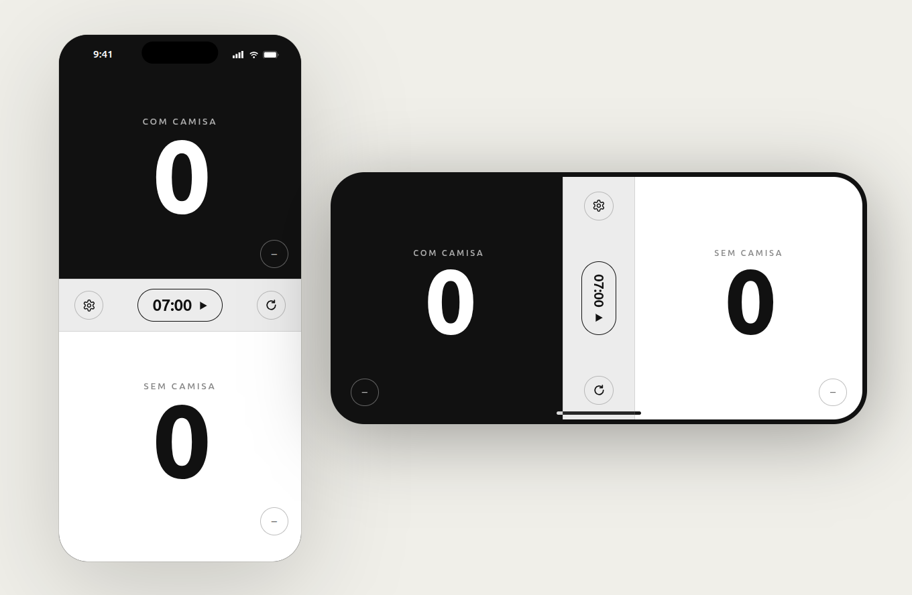

# Rachao Placar

App mobile pra controlar placar e cronômetro de partidas de basquete 3x3. React Native + Expo, offline, sem backend.

## Preview



## Stack

- React Native
- Expo + Expo Router
- TypeScript
- StyleSheet nativo (sem Tailwind/NativeWind)

## Rodando

```bash
npx expo start
```

Typecheck:

```bash
npx tsc --noEmit
```

## Detalhes do produto

Spec completa em [AGENTS.md](AGENTS.md): regras de negócio, estado, componentes, escopo do MVP.
